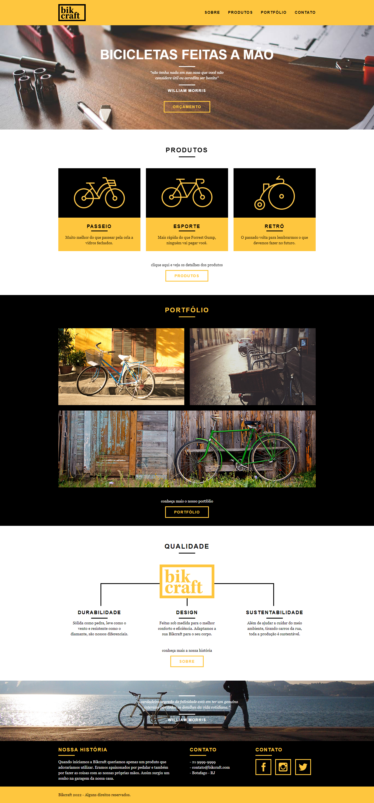

<h2 align="center"> 
	Theme Wordpress - Bikcraft 🚴🏻
</h2>

<p align="center">
 <a href="#-sobre-o-projeto">Sobre</a> •
 <a href="#-layout">Layout</a> • 
 <a href="#-como-executar-o-projeto">Como executar</a> • 
 <a href="#-tecnologias">Tecnologias</a> •  
 <a href="#-autor">Autor</a>
</p>

## 💻 Sobre o projeto

✒️ A Bikcraft é um tema wordpress customizado com foco em divugação de produtos manufaturados e serviços personalizados.

---

## 🎨 Layout

O layout foi elaborado como projeto do curso de web design no site da origamid, fundamentado nesse layout criei o tema para wordpress.

<a href="https://www.origamid.com/">
  
</a>

<p align="center" style="display: flex; align-items: flex-start; justify-content: center;">
  
</p>

<h4 align="center"> 
	🥇 Bikcraft | Concluído 🥇
</h4>

---

## 📌 Como executar o projeto

### Pré-requisitos

Antes de começar, você vai precisar ter instalado em sua máquina as seguintes ferramentas:
[Git](https://git-scm.com), [Wordpress](https://wordpress.com/pt-br/) e [Laragon](https://laragon.org/) com nginx, mysql e php 8. Além disto é bom ter um editor para trabalhar com o código como [VSCode](https://code.visualstudio.com/)

#### 🧭 Rodando a aplicação
```bash
# Acesse o projeto wordpress que deseja instalar o tema
$ cd nome-projeto
# Clone este repositório
$ git clone git@github.com:danilalucas/bikcraft.git .
# Acesse o admin do wordpress e ative o tema bikcraft
```
---

## 🛠 Tecnologias

As seguintes ferramentas foram usadas na construção do projeto:

-   **[HTML](https://html.com/)**
-   **[CSS](https://www.w3.org/Style/CSS/Overview.en.html)**
-   **[JS](https://www.javascript.com/)**
-   **[jQuery](https://jquery.com/)**
-   **[PHP](https://www.php.net/)**
-   **[Wordpress](https://wordpress.com/pt-br/)**
-   **[Laragon](https://laragon.org/)**
-   **[MySQL](https://www.mysql.com/)**
-   **[Nginx](https://www.nginx.com/)**


---

## 👩‍💻 Autor

<a href="https://github.com/danilalucas">
 
 <br />
 <sub><b>Daníla Lucas</b></sub></a> <a href="https://github.com/danilalucas" title="Profile"></a>
 <br />

[](https://www.linkedin.com/in/dan%C3%ADla-lucas/) 
[](mailto:danilatemoteolucas@gmail.com)

---

Feito com ❤️ por Daníla Lucas 👋🏽 [Entre em contato!](https://www.linkedin.com/in/dan%C3%ADla-lucas/)

---


